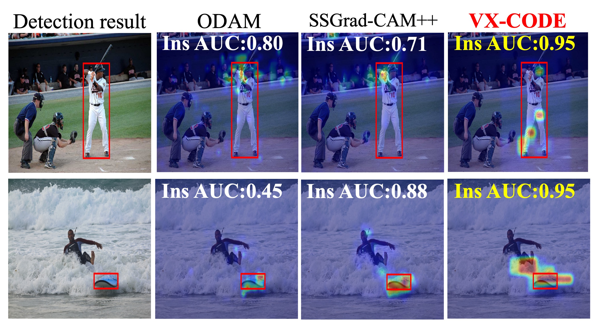
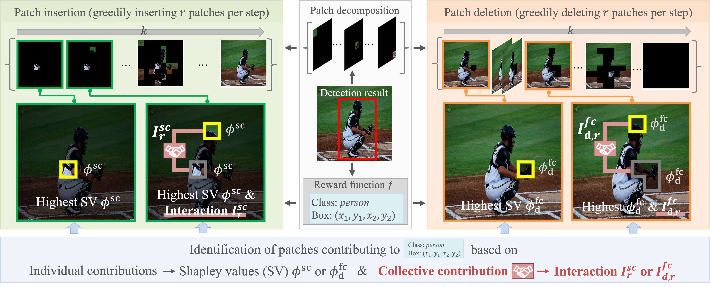

# VX-CODE: Explaining Object Detectors via Collective Contribution of Pixels ([Citation](#citation))


Official implementation of VX-CODE, proposed in “Explaining Object Detectors via Collective Contribution of Pixels.”
VX-CODE is a visual explanation method for object detectors that identifies regions contributing most to detections using greedy patch selection that considers both Shapley values and interactions.



The overall framework is shown below:


## Highlights
- Ready-to-run script `run_vxcode.py` for COCO val images with Faster R-CNN or DETR.
- Download helpers for pretrained weights (`download_weights.sh`) and COCO 2017 val images/annotations (`download_coco_dataset.sh`).
- Minimal configs under `configs/` and sample outputs under `results/` to verify the pipeline.
- Built on [Detectron2](https://github.com/facebookresearch/detectron2) for the base implementations.
- The DETR implementation is sourced from [facebookresearch/detr](https://github.com/facebookresearch/detr) and adapted in this repository.

## Repository map
- `run_vxcode.py`: entry point to build a detector, run VX-CODE, and save heatmaps/patch visualizations.
- `configs/*.yaml`: Detectron2 configs for Faster R-CNN and DETR variants.
- `weights/`: expected location for pretrained weights downloaded by the helper script.
- `datasets/`: place MS-COCO val2017 images and annotations here (Detectron2 directory layout).
- `src/`: VX-CODE implementation (`src/explanations/vxcode.py`), visualization helpers, and bundled DETR code.
- `third_party/detectron2`: Detectron2 source as a submodule.

## Setup
1) Pull submodules (needed for Detectron2):
   ```
   git submodule update --init --recursive
   ```
2) Create a Python environment with PyTorch + CUDA that matches your GPU drivers.

## Data and weights
- COCO val2017 + annotations:
  ```
  bash download_coco_dataset.sh  # defaults to datasets/coco
  ```
  Detectron2 expects `datasets/coco/val2017` and `datasets/coco/annotations/instances_val2017.json`.
- Pretrained detector weights:
  ```
  bash download_weights.sh  # downloads Faster R-CNN and DETR checkpoints into weights/
  ```
  For DETR, convert the torch-hub checkpoint to the Detectron2 format before use:
  ```
  python src/models/detr/d2/converter.py \
    --source_model weights/detr/detr-r50-e632da11.pth \
    --output_model weights/detr/detr-r50-e632da11-d2.pth
  ```

## Running VX-CODE
Run on Faster R-CNN (default config/weights):
```
python run_vxcode.py \
  --config configs/dev_faster_rcnn_R_50_FPN_1x.yaml \
  --weights weights/faster_rcnn/model_final_b275ba.pkl \
  --dataset coco_2017_val \
  --save_dir results/vxcode
```

Run on DETR:
```
python run_vxcode.py \
  --model_name detr \
  --config configs/dev_detr_256_6_6_torchvision.yaml \
  --weights weights/detr/detr-r50-e632da11-d2.pth \
  --dataset coco_2017_val \
  --save_dir results/vxcode
```

Useful flags for VX-CODE:
- `--vxcode_mode`: `del` (deletion) or `ins` (insertion) in patch selection.
- `--num_patches_per_step`: number of patches identified per step (corresponding to $r$ in the paper).


## Notes
- The scripts assume COCO is registered in Detectron2 as `coco_2017_val`. Adjust `--dataset` if you use a custom name.
- The code switches to CPU automatically when CUDA is unavailable, but VX-CODE runs are considerably faster on GPU.
- Increasing `--num_patches_per_step` (i.e., $r$) significantly raises the computational cost and runtime; we recommend setting it to $r \le 3$.

## Citation
If you use this repository in your research, please cite:
```
@misc{yamauchi2025,
  title={Explaining Object Detectors via Collective Contribution of Pixels},
  author={Toshinori Yamauchi and Hiroshi Kera and Kazuhiko Kawamoto},
  year={2025},
  eprint={2412.00666},
  archivePrefix={arXiv},
  primaryClass={cs.CV},
  url={https://arxiv.org/abs/2412.00666}}
```
